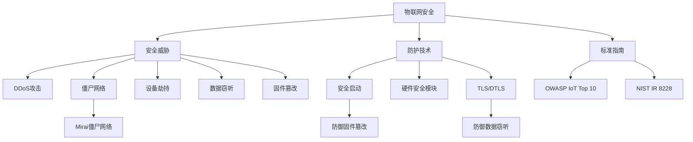

# 物联网安全知识库

本知识库基于原始资料《iot_security.txt》整理，系统化梳理了物联网安全相关的核心概念、威胁类型、防护技术及标准规范。

## 核心概念导航

### 安全威胁
- [[DDoS攻击]] - 利用僵尸网络耗尽目标资源的攻击。
- [[僵尸网络]] - 由被控设备组成的攻击网络，物联网设备是主要来源。
- [[Mirai僵尸网络]] - 2016年利用物联网设备发起大规模攻击的著名案例。
- [[设备劫持]] - 非法获取物联网设备控制权。
- [[数据窃听]] - 截获未加密的物联网通信数据。
- [[固件篡改]] - 替换或修改设备底层软件以植入恶意代码。

### 防护技术与措施
- [[安全启动]] - 确保设备只运行经过签名验证的可信代码。
- [[硬件安全模块]] - 提供硬件级密钥存储和密码学运算的安全芯片。
- [[TLS/DTLS]] - 保障物联网通信层安全的加密协议。

### 标准与指南
- [[OWASP IoT Top 10]] - 物联网十大安全风险清单。
- [[NIST IR 8228]] - 美国NIST发布的物联网设备网络安全指南。

### 总览
- [[物联网安全]] - 物联网安全领域的综合概述。

## 知识图谱关系

## 如何使用本知识库
1. 点击上述任何带`[[ ]]`的链接，即可跳转到对应概念的详细页面。
2. 每个概念页面包含摘要、详细说明、相关概念链接和待探索问题。
3. 通过“相关概念”部分可以深度探索知识网络。

## 近期更新
- 2024-05-19: 知识库初始版本建立，涵盖物联网安全核心概念。

---
*本知识库由AI知识编译器自动生成，旨在结构化呈现信息。内容基于提供的单一原始资料，如需扩展或验证，请参考更多来源。*